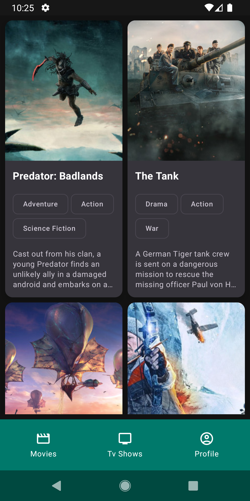
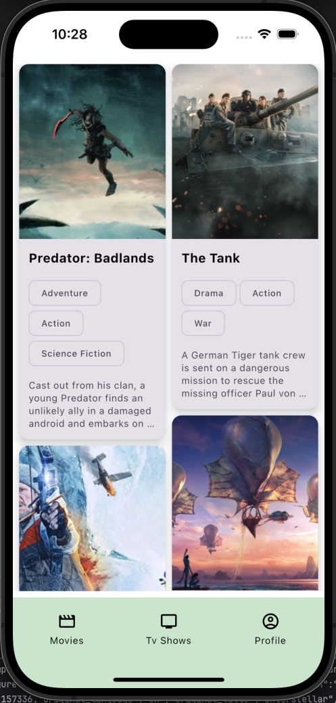
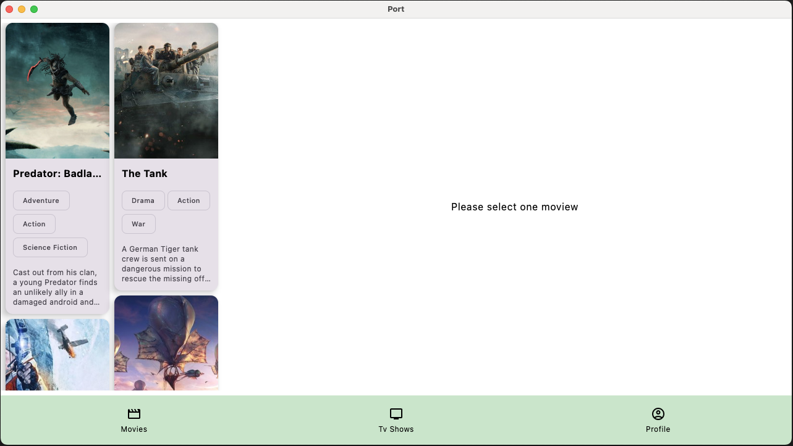
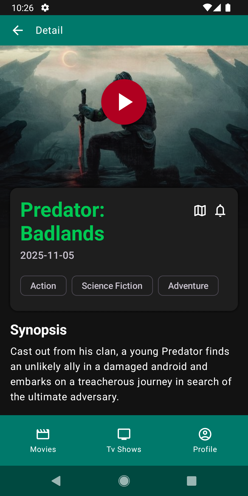
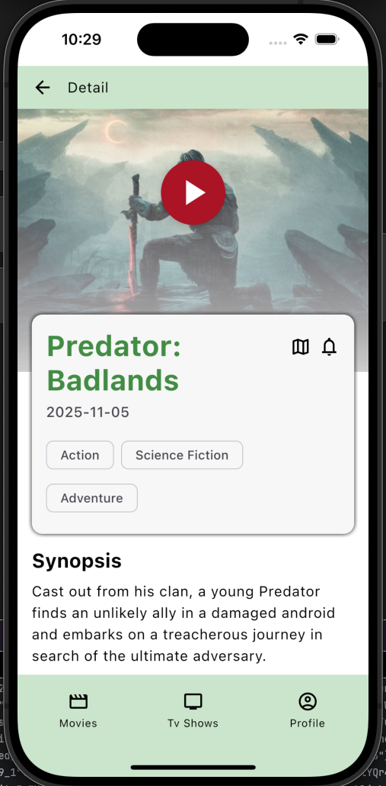
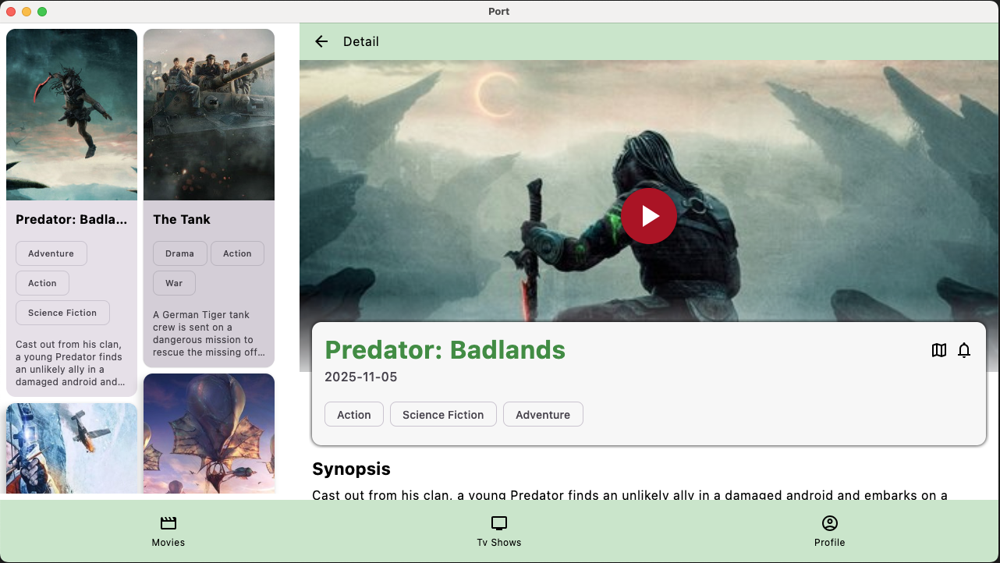

# Kotlin Multiplatform Project

This is a Kotlin Multiplatform project targeting Android, iOS, and Desktop (JVM).

## Screenshots

|                                    Android                                     |                                    iOS                                     |                                    Desktop                                     |
|:------------------------------------------------------------------------------:|:--------------------------------------------------------------------------:|:------------------------------------------------------------------------------:|
|    <br>*Main View*     |    <br>*Main View*     |    <br>*Main View*     |
| <br>*Camera/Secondary* | <br>*Camera/Secondary* | <br>*Camera/Secondary* |

## Project Structure

* **[/composeApp](./composeApp/src)** is for code that will be shared across your Compose
  Multiplatform applications.
  It contains several subfolders:
    - **[commonMain](./composeApp/src/commonMain/kotlin)**: Code that is common for all targets.
    - **Other folders**: Platform-specific Kotlin code (
      e.g., [iosMain](./composeApp/src/iosMain/kotlin) for iOS-specific calls
      or [jvmMain](./composeApp/src/jvmMain/kotlin) for Desktop specifics).

* **[/iosApp](./iosApp/iosApp)**: Contains the iOS application entry point and SwiftUI code.

## Architecture Documentation

- **[Architecture Agent Guide](./docs/ARCHITECTURE_AGENT_GUIDE.md)**: High-level module
  architecture, dependency direction rules, data flow, and reusable structure conventions for new
  KMP + Compose projects.

## Build and Run

### Android Application

To build and run the development version of the Android app, use your IDE's run configuration or the
terminal:

- **macOS/Linux**: `./gradlew :composeApp:assembleDebug`
- **Windows**: `.\gradlew.bat :composeApp:assembleDebug`

### iOS Application

To build and run the development version of the iOS app, use the IDE run configuration or open the *
*[/iosApp](./iosApp)** directory in Xcode.

### Desktop (JVM) Application

To build and run the desktop application, use the following terminal command:

```shell
./gradlew :composeApp:run
